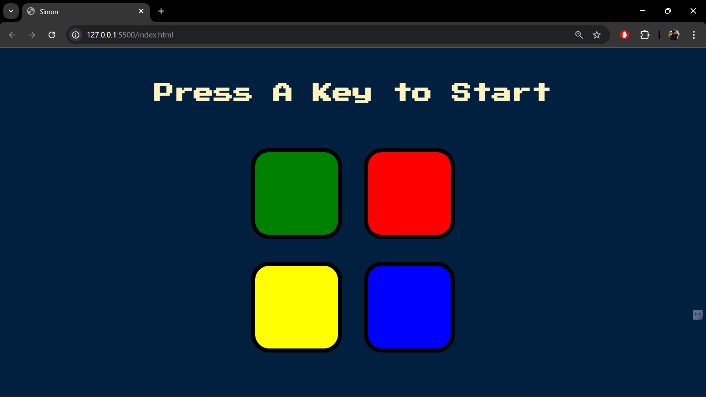
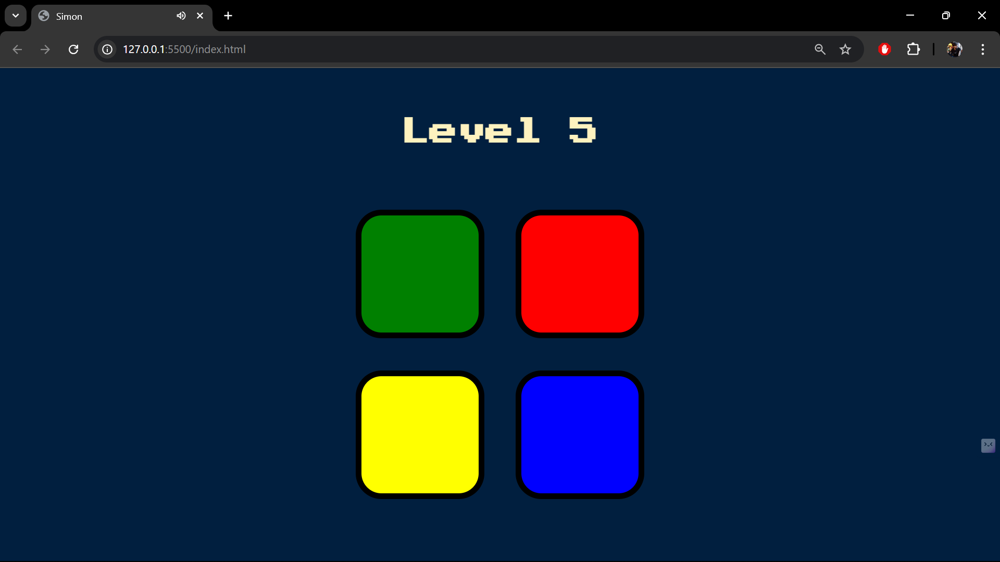
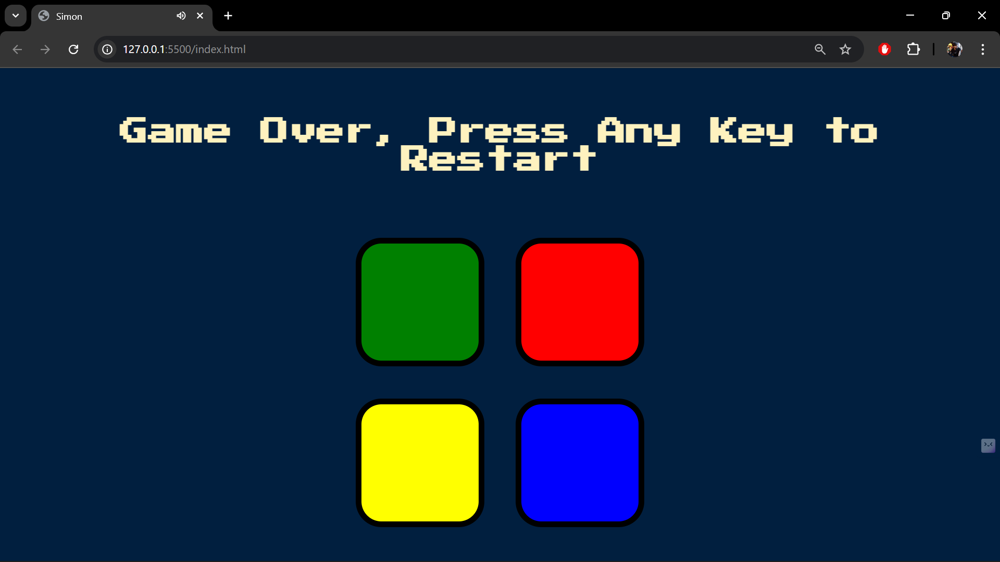

# 🎵 Simon Game 🎮  
  
  
  
  

A modern web-based version of the **classic Simon Game**, built with **JavaScript, jQuery, callback functions, DOM manipulation, sound, and animations**. The game challenges users to **remember and repeat an increasing sequence of colors and sounds** as the level progresses.  

---

## 🚀 Features  

- ✅ **Dynamic Game Pattern** – Sequence generated randomly at each level  
- ✅ **Interactive UI** – Color buttons with smooth animations  
- ✅ **Sound Integration** – Unique sound for each button + wrong move alert  
- ✅ **Level Tracking** – Game difficulty increases with levels  
- ✅ **Keyboard Event Listener** – Start the game with a key press  
- ✅ **Advanced Concepts** – Callback functions, event listeners & jQuery animations  

---

## 🖥️ Demo  

  
  


---

## 🛠️ Tech Stack  

- **HTML5** – Game structure  
- **CSS3** – Styling & layout  
- **JavaScript (ES6+)** – Game logic  
- **jQuery** – Animations & DOM manipulation  

---

## 📂 Project Structure  

```
├── index.html         # Main game HTML file  
├── styles.css         # Game styling  
├── game.js            # Core game logic (JS + jQuery)  
├── sounds/            # Audio files for buttons & wrong sound  
└── screenshots/       # Screenshots for documentation  
```

---

## 🎮 How to Play  

1. **Start Game** → Press any key.  
2. **Watch Carefully** → Simon shows a sequence (color + sound).  
3. **Repeat** → Click buttons in the same order.  
4. **Level Up** → A new color is added each round.  
5. **Game Over** → Wrong input resets the game.  

---

## 🧩 JavaScript Concepts Used  

- **Event Listeners** (`keypress`, `click`)  
- **Callback Functions** (sound & animation handling)  
- **jQuery Animations** (`fadeIn`, `fadeOut`, `addClass/removeClass`)  
- **Arrays** for storing patterns (`push`, index checking)  
- **Game State Management** (reset, restart, progress tracking)  

---

## 📸 Screenshots  

### Game Interface  
  

### Level Progress  
  

---

## 🔊 Sounds  

- 🟥 **Red** → `red.mp3`  
- 🟦 **Blue** → `blue.mp3`  
- 🟩 **Green** → `green.mp3`  
- 🟨 **Yellow** → `yellow.mp3`  
- ❌ **Wrong Move** → `wrong.mp3`  

---

## ⚡ Getting Started  

### Clone the Repository  

git clone https://github.com/TheRealUjjwal/simon-game.git
cd simon-game


### Run the Project  
Open `index.html` in your browser or run with **VS Code Live Server**.  

---

## 📌 Future Improvements  

- 🔹 High score tracking  
- 🔹 Mobile support  
- 🔹 Difficulty levels (easy, medium, hard)  

---

## 📜 License  

Licensed under the **MIT License** – free to use and modify.  

---

✨ Built with ❤️ using **JavaScript & jQuery**  
